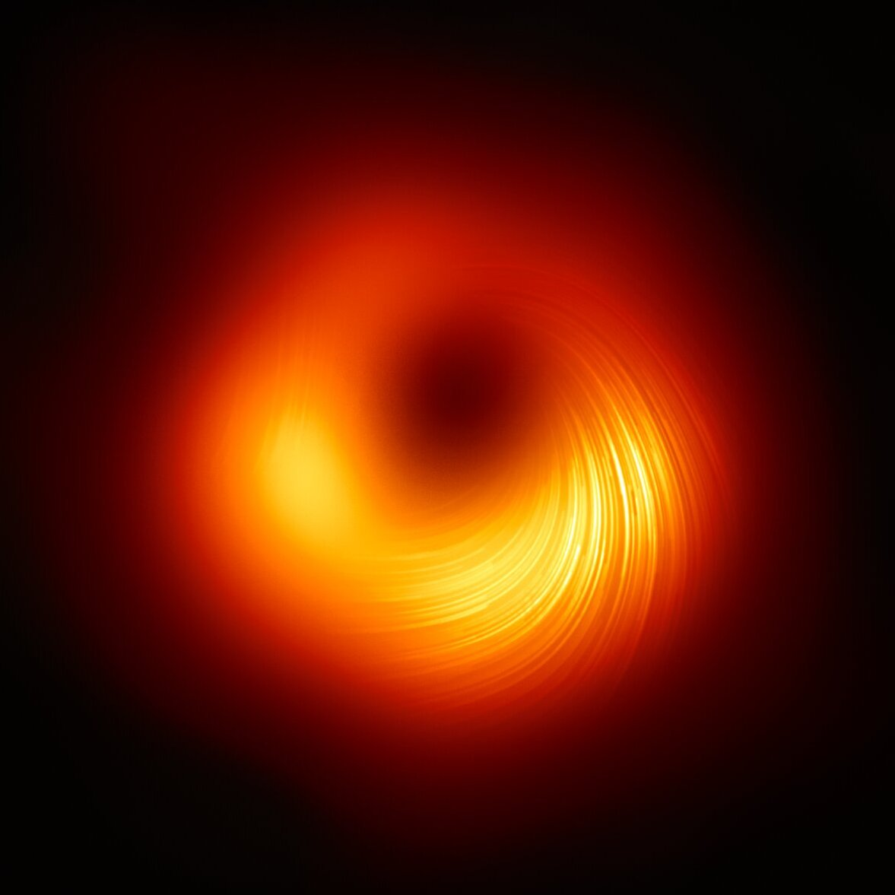

## 黑洞

人類首次看見了黑洞。  
 
二○一九年，參與「事件視界望遠鏡」合作計畫的科學家們，在國際記者會上，發布了史上第一張黑洞影像。  
 
神秘、黑暗、危險，是黑洞給我的第一印象。小時候，我總覺得黑洞是一隻巨獸，悄悄地蟄伏在某個角落。只要一不留神就會被吞噬，陷入時空的流沙，繞著永恆的圓心旋轉，下沉，最後在深不見底的黑暗裡吶喊。  
 
對於未知，我們總是下意識地抗拒。可能是因為害怕失去。害怕死亡。害怕忽然發覺思維並不連續。害怕失去存在的意義，像《神隱少女》中的白龍遺失自己的名字。不過，若從演化的觀點來看，這也未嘗不是一種自我保護。即使生活在這不再需要徒手搏獸的時代，人類依然保有一種抵抗變動的慣性。  
 
 
合理地猜想，如果沒有光線能從中發散出來，黑洞應該會是恰如其名的黑色吧。百年以來，雖然從來沒有任何人能夠直接觀測到黑洞本體，只能間接探測周圍發生的效應，但黑洞神秘的特性，成為了很多科幻小說或電影的題材。像前幾年上映的電影《星際效應》，就講述了一個關於黑洞的故事：在未來的時代，地球由於氣候變遷而發生糧食危機，研究顯示，有三顆圍繞黑洞「巨人」的星球可能適宜人居，於是太空總署負責人布蘭德教授想出了兩個計劃。A計劃為確認星球適居性後，透過布蘭德教授的重力方程式，協助人類移往該地居住；B計劃則是帶著數萬個胚胎殖民，放棄所有留在地球上的人類，在新的星球浴火重生。曾是太空總署駕駛員的庫柏，因為精湛的駕駛技術而受託執行計劃，登上永續號，開始了太空之旅。然而僅有十歲的女兒墨菲，是庫柏在世上最大的牽掛。遺憾的是，墨菲在庫柏離開之前，一直都無法諒解爸爸的選擇，兩人甚至沒有好好地道別。庫柏最後留下了一支他經常戴的手錶作為臨別禮物，希望這支錶能替他守護心愛的女兒。  
 
明知沒有希望而繼續等待，需要多大的勇氣？歲月匆匆，長大成人的墨菲成為了一位天文學家，承接布蘭德教授的志業，繼續研究重力方程式；還在太空的庫柏則遭遇了接踵而來的意外。一開始他們不小心在米勒星耽擱太久，那裡因為距離「巨人」過近，使得一小時約等於地球的七年，等到終於發現米勒星不宜人居，時間已經過了二十三年。還有，庫柏也意識到A計劃沒有實現的可能，其實這是布蘭德教授善意的謊言，因為如果少了黑洞重力奇異點的數據，重力方程式根本不可能解開。雪上加霜的是，此時永續號的燃料已不足以返回地球，庫柏為了減少總質量讓夥伴逃生，決定分離自己的艙室，最後被吸入黑洞。不過迎接庫柏的並不是預想中的死亡，而是一個第五維度超立方體，由未來的人類所建構。在他們的幫助之下，庫柏將黑洞的數據藉由墨菲的手錶傳送給她。有了這些珍貴的數據，墨菲才終於解開重力方程式，使人類得以離開地球，前往環繞土星的太空站居住。後來庫柏也被未來的人類送回土星，離開了地球整整九十一年，終於得以和年老垂死的墨菲重逢。庫柏凝望著病床上的女兒，想像著這些年來空缺的時光，儘管不再生離，他們卻又面臨了死別。這次，墨菲選擇放手讓庫柏離開，因為不忍讓他看見自己這副衰老的模樣。愛是一種力量，即使超越時空的維度，也能感知到它的存在。  
 
我喜歡這部電影，因為劇情不僅跌宕有致，而且情緒刻劃得也很細緻。不過，《星際效應》最廣為人知的地方，其實是請了物理學家來實際計算，並推測現實世界中黑洞應該具有的樣貌。當然，那些畫面都還只是模擬而已。要到這次記者會上發布的影像，才首度直接證明了黑洞的存在。  
 
 
在這張影像中，我們可以看到一圈不對稱的光環，圍繞著中央的黑色暗影。我驚詫於黑洞並非原先設想的純黑。外圍的光環以黯淡深沉的橘紅色為基調，下方隱隱透出盛夏，似一種熾熱而明亮的流金。那至黑之處，竟也有陽光閃耀。一條溫潤的河莊嚴而溫柔地流動著。嗡。我彷彿聽見宇宙原初的召喚。  
 
這世界從來就不是我們熟悉的二元體系，而是一種兼容並蓄的有機體。觀音所在的山上，也能有罌粟蓬勃綻放。黑洞真的那麼可怕嗎？在作出評斷的同時，也面臨了意義被切割的風險。描述事物的介質是語言，但語言其實只能表現其中一部份的特質。好比顯微鏡下的植物導管切片，觀察到的僅僅只是一個截面，縱剖是長方，橫切是圓。然而，就在我試圖描述之時，事物的狀態已經切換成下一個瞬間。於是在名為永恆的牢籠裡，我展開一連串的追逐——阿基里斯依舊追著上一刻的烏龜，倉鼠在滾輪上跑動，小狗以順時鐘方向繞成太極。  
 
這無懈可擊的圓卻又讓我想起黑洞。在科學上，黑洞可被量測的最大極限被稱作「事件視界」，意思是：事件可被觀測的邊界。根據相對論，假使我們無限逼近黑洞，那麼不斷增加的重力，將使得時間的流速越來越慢。到了事件視界，重力的大小剛好足夠把光往回拉，於是沒有任何資訊能從中傳出。裡面究竟發生了什麼，完全沒有人知道。也許，我們都是黑洞的化身。  
 
在最深、最深的核心，時空的概念消失了，或者這樣的描述方式從不存在。絕對的寧靜中，似乎有著什麼在凝聚，成形，復而消散。我想起自己曾在某座山巔，花了好幾個小時觀雲。雲浪不斷翻湧如思緒，進而幻化成萬物：有雄鹿奔馳穿梭，來到河邊舔舐甘甜的泉水；有松鼠啃著栗子，偶爾警惕環顧四周，擔心捧在手中的食物被攫走。山林吐納的氣息，是一股極其充沛的生命力，也是靜坐的姿勢。  
 
我習慣於每個睡前的夜晚盤腿靜坐。闔上雙眼，逐漸沉澱雜質，默念一遍《心經》是進入禪定的儀式。接著我會專注於呼吸。深深地吸一口氣，想像世間所有痛苦與哀傷都被我吞噬掉，一如黑洞毫無保留地吞噬。似乎有一些紊亂躁動的粒子在體內互相碰撞，迸發，然後分裂。我溫柔地把身體放鬆下來，允許這一切繼續發生。而意識在不知不覺間抽離，從高處俯視自身；萬物生滅，彷彿諦聽一首悲壯的交響曲。此刻，慈悲的光緩緩流過全身，能量逐漸以和諧的頻率振動著。嗡。我似乎改變了什麼，卻又好像什麼都沒有改變。世界原本就是這樣的啊。我慢慢地吐氣，釋放和煦的光流，在寧靜祥和的氛圍裡睡去，歸零自己，準備迎接下一次循環，以及變動。我一直相信，在這複雜多層次的世界中，萬物都有其安身之處。  
 
而黑洞依舊孤獨地自轉，就這麼旋成一整個星系。

 

#### (第三十屆建中紅樓文學獎散文組二獎作品)

---

 

## Blackhole

Humans saw a black hole for the first time.  
 
In 2019, scientists participating in the Event Horizon Telescope collaboration released the first image of a black hole in history at an international press conference.  
 
Mysterious, dark, dangerous—these were my first impressions of a black hole. When I was a child, I always imagined it as a giant beast lurking quietly somewhere in the corner of the universe. If one were not careful, it would swallow everything whole, dragging it into the quicksand of spacetime, circling the center of eternity, sinking deeper and deeper, until finally shouting into an unfathomable darkness.  
 
When faced with the unknown, we instinctively resist. Perhaps it is because we fear loss. We fear death. We fear suddenly discovering that thought itself is not continuous. We fear losing the meaning of existence, like Haku in *Spirited Away* forgetting his own name. Yet from an evolutionary perspective, such resistance may simply be a form of self-protection. Even in an age where we no longer wrestle beasts with our bare hands, humanity still carries an inertia against change.  
 
 
It seems reasonable to suppose that if no light can escape from it, a black hole should indeed be black. For more than a century no one had ever directly observed a black hole itself; we could only infer its existence from the effects occurring around it. Yet the mysterious nature of black holes has inspired countless works of science fiction and film. One such example is the movie *Interstellar*, released a few years ago.  
 
In the film, humanity faces a food crisis caused by climate change on Earth. Research suggests that three planets orbiting the black hole Gargantua might be habitable. Professor Brand, the head of NASA, proposes two plans. Plan A is to confirm the planets’ habitability and then use Brand’s gravitational equation to transport humanity there. Plan B is to bring tens of thousands of human embryos to colonize a new world, abandoning everyone left on Earth and allowing the species to begin again.  
 
Cooper, a former NASA pilot, is entrusted with the mission because of his exceptional flying skills. He boards the spacecraft Endurance and begins the journey into space. Yet his ten-year-old daughter Murph is the person he cares about most in the world. Tragically, Murph cannot understand her father’s decision before he leaves, and the two never properly say goodbye. Cooper leaves behind the watch he always wears as a farewell gift, hoping it will somehow protect his beloved daughter.  
 
How much courage does it take to keep waiting when you know there is no hope? Years pass. Murph grows up to become an astrophysicist, continuing Professor Brand’s work on the gravitational equation. Meanwhile Cooper encounters one accident after another in space.  
 
They first spend too long on Miller’s planet, which lies so close to Gargantua that one hour there equals seven years on Earth. By the time they discover the planet is not habitable, twenty-three years have passed. Cooper also realizes that Plan A was never possible—it was merely a benevolent lie from Professor Brand, because without data from the black hole’s gravitational singularity, the equation could never be solved.  
 
To make matters worse, the Endurance no longer has enough fuel to return to Earth. To reduce the ship’s mass and allow his companions to escape, Cooper detaches his own module and is ultimately pulled into the black hole. Yet instead of death, he encounters a five-dimensional tesseract, constructed by humans from the future. With their help, Cooper sends the black hole’s data to Murph through the watch he left her. With those precious data, Murph finally solves the gravitational equation, enabling humanity to leave Earth and live on space stations orbiting Saturn.  
 
Later, Cooper himself is returned to Saturn by those future humans. After being away from Earth for ninety-one years, he finally reunites with Murph—now elderly and dying. Standing beside his daughter’s hospital bed, Cooper imagines the years of life he missed. Although they are no longer separated by distance, they now face another separation: death. Murph chooses to let Cooper leave again, unwilling for him to watch her grow old. Love is a force that transcends dimensions—even those of time and space.  
 
I like this film not only because the plot rises and falls with gripping tension, but also because its emotional details are rendered with great care. Yet what Interstellar is most famous for is that physicists were invited to calculate and simulate how a real black hole might look. Of course, those images were still only simulations. Only with this photograph released at the press conference in 2019 did we finally obtain direct evidence of a black hole’s existence.  
 
 
In that image, we see an asymmetric ring of light surrounding a dark shadow at the center. What surprised me most was that the black hole was not purely black as I had once imagined. The outer ring glows with a deep, muted orange-red tone, and near the lower edge one senses the heat of midsummer, like molten gold burning brightly. Even within the deepest darkness, sunlight seems to flicker. A gentle river flows—solemn yet tender.  
 
Om. I seem to hear the universe calling from its beginning.  
 
This world has never been the binary system we imagine. It is an organism capable of holding contradictions together. On the same mountain where Guanyin resides, poppies may bloom in abundance. Are black holes truly so terrifying? The moment we judge something, we risk cutting apart its meaning. Language is the medium through which we describe the world, yet language can reveal only fragments of it. Like a microscopic cross-section of plant vessels: in one direction it appears rectangular, in another circular. But even as I attempt to describe it, the state of things has already shifted to the next moment.  
 
And so, within a prison called eternity, I begin a series of pursuits—Achilles still chasing the turtle of the previous instant, the hamster running on its wheel, a small dog circling clockwise into the shape of Tai Chi.  
 
This flawless circle reminds me once more of a black hole. In physics, the maximum measurable boundary of a black hole is called the event horizon—the limit beyond which events can no longer be observed. According to relativity, if we approach a black hole infinitely closely, the increasing gravity will slow the flow of time. At the event horizon the gravitational pull becomes strong enough to drag even light back inward. No information can escape. What happens inside remains completely unknown.  
 
Perhaps we ourselves are manifestations of black holes.  
 
At the deepest core, the very concept of spacetime disappears—or perhaps such a description never truly existed. Within absolute stillness something seems to gather, to take form, and then dissolve again. I remember standing once on a mountaintop, watching clouds for several hours. The waves of cloud rolled endlessly like thoughts, transforming into countless shapes: a stag racing across the sky to drink from a river; a squirrel nibbling chestnuts, occasionally glancing around in caution lest its food be stolen. The breathing of the forest is an immense vitality—and also the posture of meditation.  
 
Each night before sleep I sit cross-legged in meditation. Closing my eyes, letting the impurities settle, I recite the Heart Sutra once as a ritual of entering stillness. Then I focus on my breath. I inhale deeply, imagining that all the pain and sorrow of the world are swallowed within me—just as a black hole devours everything without reservation. Chaotic particles seem to collide within the body, bursting and dividing. I gently relax my body and allow everything to continue unfolding.  
 
My consciousness gradually detaches, looking down upon itself from above. All things arise and perish, like listening to a tragic symphony. At that moment a compassionate light flows slowly through the body; energy vibrates at a harmonious frequency. Om. It seems as though something has changed—yet nothing has changed at all. The world has always been this way.  
 
I slowly exhale, releasing a gentle stream of light. Within a quiet and peaceful atmosphere I fall asleep, resetting myself, preparing for the next cycle and the next transformation. I have always believed that in this complex, multilayered world, everything has a place where it belongs.
 
And the black hole continues its lonely rotation, spinning until it becomes an entire galaxy.

 
(Second Prize, Prose Category, 30th Chien Kuo High School Red Chamber Literary Award)  

 
 

  <figure style="flex: 1; margin: 0; text-align: center;">
    
    <!--<figcaption>Caption for photo</figcaption>-->
  </figure>

