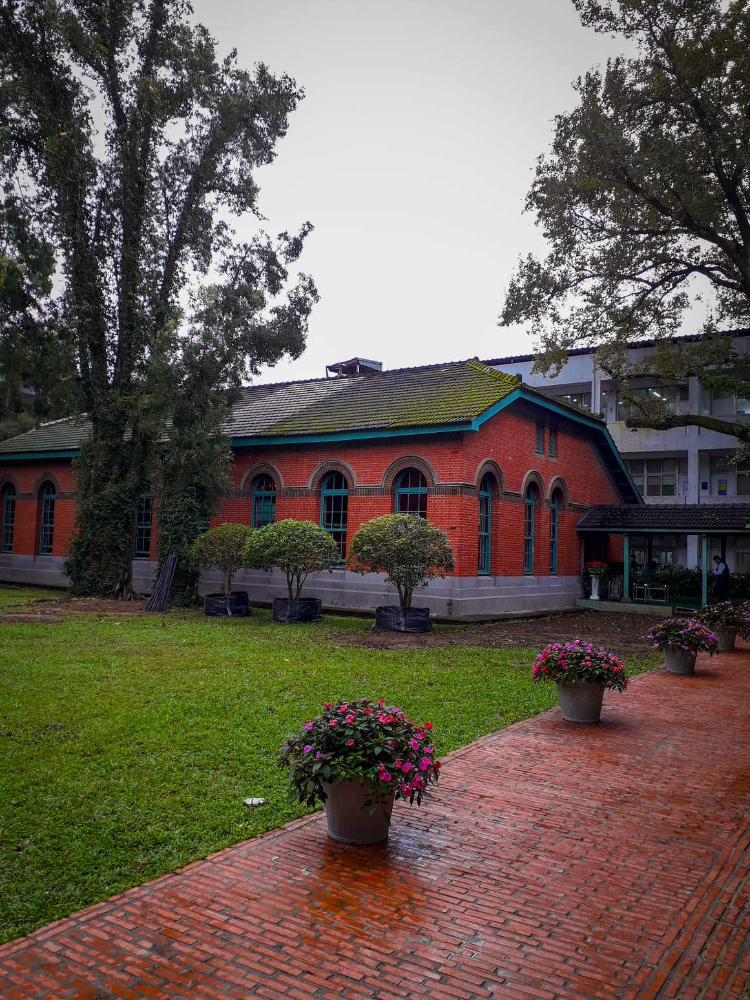
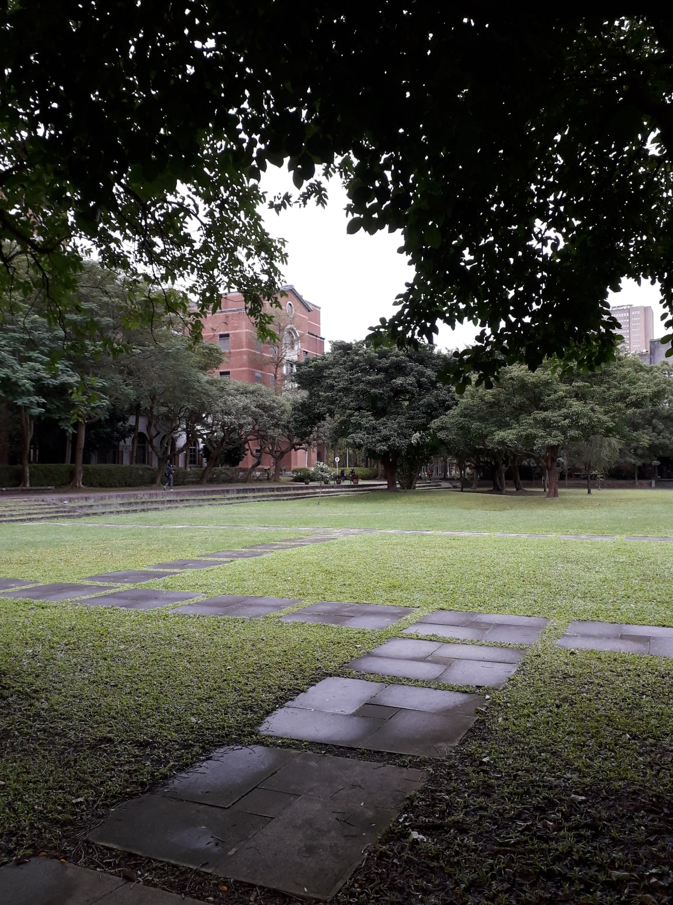
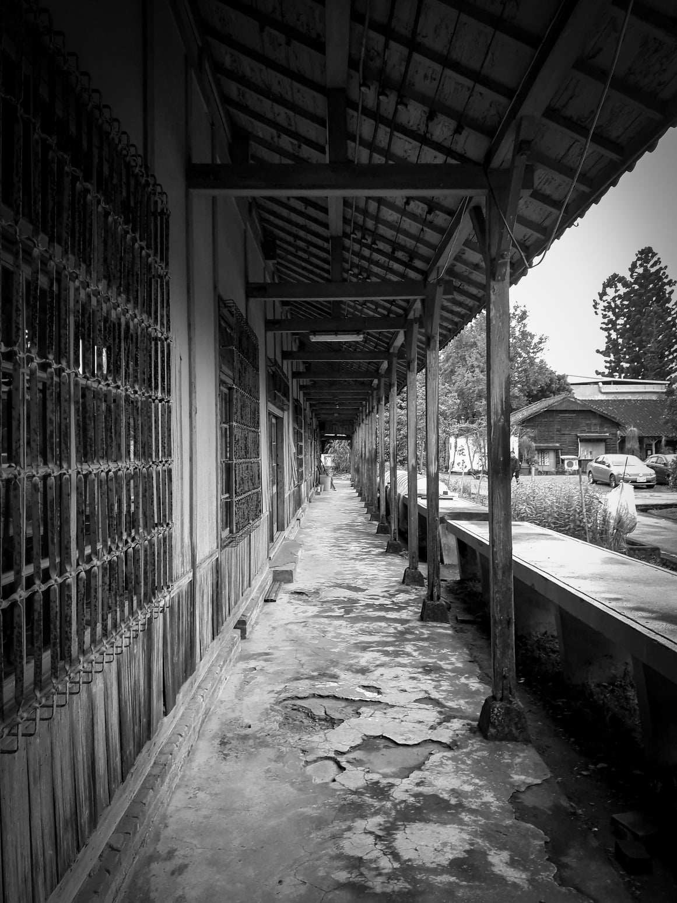
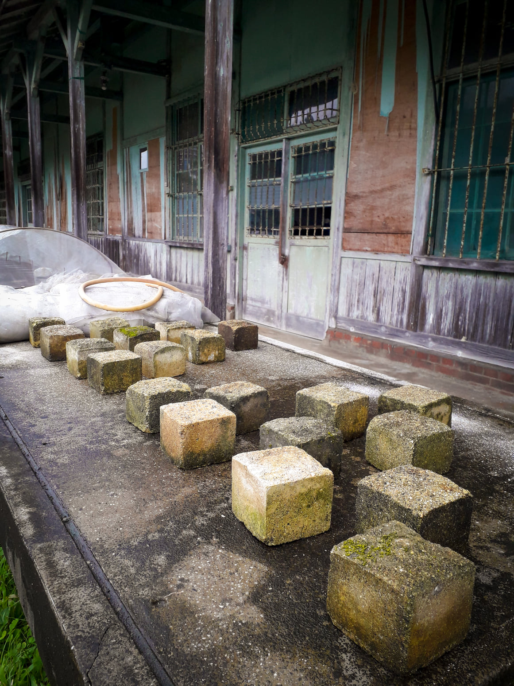
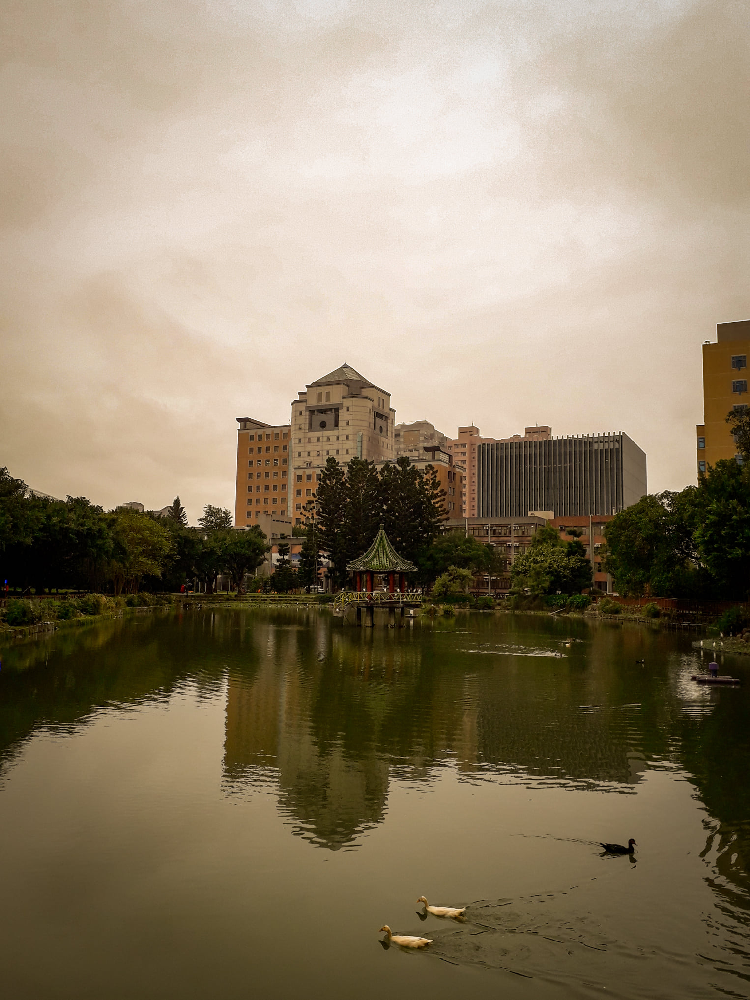

## 微微有雨

微雨。十二月。  
 
彷彿來到林文月筆下的翡冷翠，我們穿梭於臺大猶如古蹟的建築群中。這個上午，我才剛做完三節早九的化學實驗，接下來第十節還要上微積分。在繁忙之間的罅隙裡，難得有一趟臺大校園內的分組小旅行，我感覺自己身在一個平行的時空。  
 
第一站是行政大樓。走進大門的瞬間，我忽然想起美國的黃金時代，一九二○，紐約。沉蘊著暗金色光澤的氛圍緩緩流淌開來，小提琴的氣息，好比一首巴洛克時期的奏鳴曲。這裡不愧是臺大的行政樞紐。再走進去，左轉，便來到了建築的內部。這裡的設計交雜得十分微妙：中央的草地與紅磚建築是歐式庭園的風格；周圍帶有國中教室的氣味的斑駁磁磚構成了走廊的地板。面對這既陌生又熟悉的場景，我試著回憶自己的中學生活，卻發現那段看似近在眼前的青春時光，其實已經離我好遠好遠。細雨濛濛，我的心中泛起細微的漣漪。  
 
來到臺大以後，我才知道原來椰林大道分隔著兩個調性截然不同的國度。  
 
普通。綜合。博雅。新生。各棟教學館大抵座落在椰林大道的北方。北方是我的主要活動範圍。由於大一課程安排十分緊湊，我甚少有機會跨越邊境到南方的國度漫遊。傳說中的共同教學館一直停留在聽說過但沒去過的神祕階段。小木屋鬆餅倒是買過一兩次，幸福的滋味果真名不虛傳。  
 
同組的L說想去看牛。於是，我們朝著舟山路旁的農業試驗場行進。途中經過農業綜合大樓時剛好遇到了大福，沒想到和朋友打趣的地點竟然如此真實地存在著。大福所在的地下室十分隱密，一不小心就會擦身而過，怪不得鮮少人知。還沒走到門口，一種軍公教福利社特有的清潔用品氣味迎面而來。我想起六、七歲時奶奶經常帶我到離家不遠的福利社買東西，好久沒有聞到這樣的氣味了。老實說我不怎麼喜歡這樣的味道，但人就是這樣，再怎麼不喜歡的東西，只要鍍上一層關於家的記憶，再怎麼不好吃的家常麵條也會令人無比懷念。大福裡面賣的東西大部分是價格實惠的零食，泡麵，和一些冷凍的海鮮食品。我推測主要客群應該是教職員，畢竟除了極少數幫家裡採購食品的人以外，一般學生大概不會買冷凍蝦子來煮吧，就算住的是宿舍，房間內也不能開火。  
 
再往前走，通過長長的迴廊就是小小福了。隔壁是傳說中的共同教學館，但是我們只拍了幾張照片而沒有進去，大樓寫著英文名稱的深棕木牌在雨中顯得模糊，後方的樹叢格外翠綠，此處是南方的國度，也是憂鬱的熱帶。看牛迫切的欲望驅使我們繼續前行。路上，繁忙的人們不斷從一旁擦身而過，或騎車，或步行。忽然覺得我們行進的步調悠閒得格外不自然。不，或許這才應該是自然。微雨的午後，更加適合這樣一種極淡的藍灰色憂鬱，和隱隱探索的欲望。舟山路上有座小小的拱橋，其實我覺得比較像稍稍拱起的路。橋的右側是瑠公圳水源池，之前經過的時候，我都沒有發現原來這片水域這麼具有歷史意義。於是我決定拿起相機紀念歷史。池邊的木欄杆上站滿了一排灰鴿，像極了一幅雨中即景的水彩。  
 
終於來到了農業試驗場，但踅來踱去，絲毫不見牧場的蹤影。該不會是牛群集體隱居起來了吧，我暗自想著。這時有人拿起手機一查，才發現牧場在臺科大對面的另一個校區。雖然有些失望，但我們還是決定參觀一下這片農場。自田壟望去，發現這裡試驗的是各種品類的花，一望無際的草地和樹牆。我暫時忘記了這裡還是大學的內部。但我不會忘記此處原汁原味的農舍，因為不論是誰拍張照片給我看，我肯定不會相信這裡是臺北市。不過換個角度想，臺北八十年前的樣貌應該就是如此吧，只是時間被定格了而已。一九三○，臺北。某間農舍前的地面上放置了兩群正方體石塊，每群有十塊岩石，排列方式和保齡球瓶一樣對稱。這兩群石塊雖然和巨石陣一樣意義不明，但仍帶有某種原始莊嚴的美感。  
 
最後是醉月湖。失焦的氣息令人沉醉。煙水茫茫，千里斜陽暮，我仍記得來時的路途。平靜的湖面上，兩隻白鴨拖著悠長的V字向西方划去，不遠處一隻黑鴨朝著相反的方向前行。這微雨的午後，我不想武斷地將特立獨行的黑劃歸到叛逆的範疇裡，也不想讚嘆佔多數的白是多麼的純潔高尚。我只是靜靜地望著牠們的軌跡，交錯，而後分離，像是擦身而過的彗星。靜謐的時刻並不需要過多的評論。凝視湖中的涼亭，內心不禁浮現秦觀的「霧失樓臺，月迷津渡」。雖然不見月色，但我想這種朦朧的美感是相通的。  
 

  <figure style="flex: 1; margin: 0; text-align: center;">
    
    <figcaption style="margin-top: 0.5rem;">行政大樓中央的草地與紅磚建築。1919年的生徒控所。</figcaption>
  </figure>
  <figure style="flex: 1; margin: 0; text-align: center;">
    
    <figcaption style="margin-top: 0.5rem;">總圖後方的石板步道。</figcaption>
  </figure>

  <figure style="flex: 1; margin: 0; text-align: center;">
    
    <figcaption style="margin-top: 0.5rem;">一九三○，臺北。</figcaption>
  </figure>
  <figure style="flex: 1; margin: 0; text-align: center;">
    
    <figcaption style="margin-top: 0.5rem;">雖然和巨石陣一樣意義不明，但仍帶有某種原始莊嚴的美感。</figcaption>
  </figure>
  <figure style="flex: 1; margin: 0; text-align: center;">
    
    <figcaption style="margin-top: 0.5rem;">我只是靜靜地望著牠們的軌跡，交錯，而後分離，像是擦身而過的彗星。</figcaption>
  </figure>

